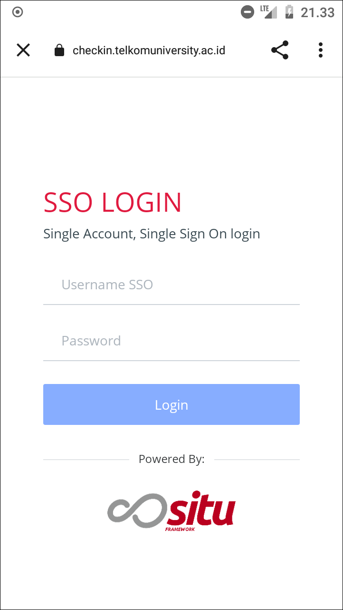
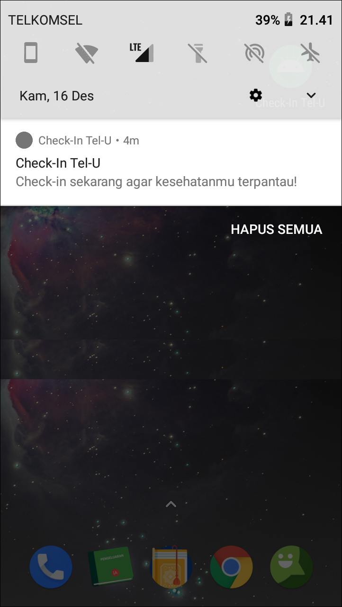

# Check-In Tel-U

Aplikasi Android yang menggunakan FirebaseUI untuk fitur login dengan akun Google pengguna. Setelah login, pengguna dapat melakukan check-in. Pengguna juga akan mendapatkan reminder check-in berupa notifikasi.

Aplikasi ini juga menggunakan Firebase Cloud Messaging (FCM) untuk mendapatkan notifikasi berupa pengumuman. Notifikasi ini mengandung custom data yang dapat ditangani aplikasi di foreground ataupun background.

Tampilan Utama                               | Custom Tabs                                   | Notifikasi
---------------------------------------------|-----------------------------------------------|--------------------------------------------------
||

Aplikasi ini menggunakan beberapa library lain, diantaranya:
- Glide, untuk mengambil foto profil pengguna dari server
- CircleImageView, untuk menampilkan foto profil pengguna
- Custom Tabs, untuk menampilkan web check-in dan pengumuman

Punya pertanyaan atau masukan? Silahkan disampaikan melalui issue repository ini.

## Lisensi

    Copyright (c) 2020 Indra Azimi. All rights reserved.

    Dibuat untuk kelas Pemrograman untuk Perangkat Bergerak 2.
    Dilarang melakukan penggandaan dan atau komersialisasi,
    sebagian atau seluruh bagian, baik cetak maupun elektronik
    terhadap project ini tanpa izin pemilik hak cipta.